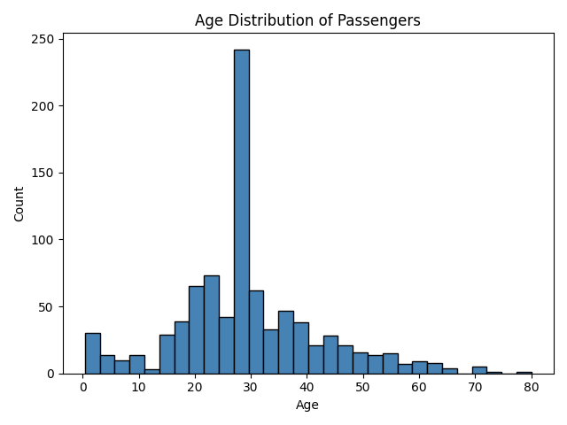
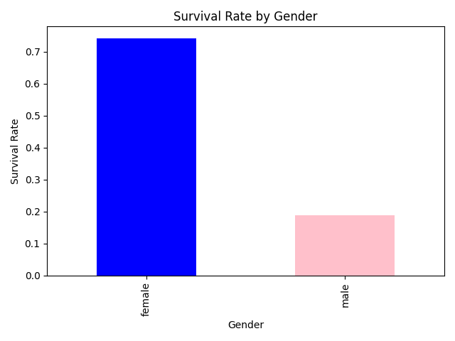
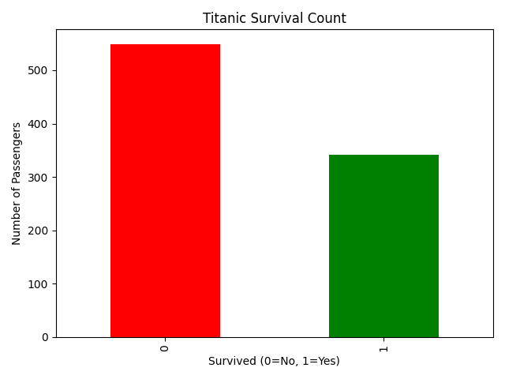

# Titanic Survival Analysis

# Project Description
This project is an Exploratory Data Analysis (EDA) of the Titanic dataset.

The goal of this analysis is to explore patterns in passenger data and identify the key factors that influenced survival during the Titanic disaster.

This project focuses on:
- Data cleaning and preprocessing
- Feature engineering
- Data visualization
- Extracting meaningful insights from real-world data

---

# Dataset Overview

The dataset contains information about **891 passengers** with **12 columns**:

| Column | Description |
|-------|-------------|
| PassengerId | Unique ID for each passenger |
| Survived | Survival (0 = No, 1 = Yes) |
| Pclass | Ticket class (1 = 1st, 2 = 2nd, 3 = 3rd) |
| Name | Passenger name |
| Sex | Gender of passenger |
| Age | Age in years |
| SibSp | Number of siblings/spouses aboard |
| Parch | Number of parents/children aboard |
| Ticket | Ticket number |
| Fare | Ticket fare |
| Cabin | Cabin number |
| Embarked | Port of embarkation |

---

# Key Findings

# 1. Gender played a major role
- Female survival rate was significantly higher with 74% compared to male with 19% survival rate
- This supports the "women and children first" evacuation strategy

---

# 2. Passenger class affected survival
- 1st class passengers had the highest survival rate of 63%
- 3rd class passengers had the lowest survival rate of 24%
- This is most likely because passengers in first class were closer to life boats.

---

# 3. Family size influenced survival
- Small families had higher survival rates
- Large families had lower survival rates
- Passengers traveling alone had mixed outcomes
- This suggest that passengers that were in a family were able to help each other out 

---

# 4. Age had an impact
- Children had higher survival rates of 58%
- Older passengers had lower survival rates of 23%
- this also supports the "women and children first" evacuation strategy

---

# 5. Best survival combination
- Female + 1st Class = Highest survival probability

---

# 6. Worst survival combination
- Male + 3rd Class = Lowest survival probability

---

# Data Visualizations

# 1. Age Distribution

# 2. Survival by Gender

# 3. Top Survival Groups

# 4. Family Size vs Survival

---

# Conclusion

The analysis shows that survival on the Titanic was not random.

Key factors such as:
- Gender
- Passenger class
- Family size
- Age

strongly influenced survival outcomes.

Social factors like evacuation priority and access to lifeboats played a major role in determining who survived.

This project demonstrates how data can be used to uncover hidden patterns and tell meaningful stories about real-world events.

---

# Tools Used

- Python  
- Pandas  
- Matplotlib  

---

# Author

Abdul — AI & Machine Learning Learner  
Documenting my journey into data science and AI.
